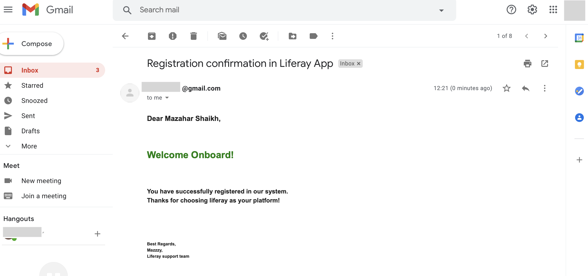

# liferay-register

Liferay based Registration app, with basic validation and success email after registration
It has been developed as MVC portlet along with Service builder to perform DB operations and email configuration to send emails.

# Technologies Used:

- Liferay DXP 7.3.
- Java 11.
- MySQL 8.0.22.
- Dev Tools:
  - Liferay studio `7.3.10` bundled with tomcat `9.0.37`.
  - MySQL connector jar file `mysql-connector-java-8.0.22.jar`.
  - MySQL Workbench for DB view

# Configurations:

1. Added MySQL connector jar file for DB dependency inside `tomcat/lib/ext`
2. Service builder for DB schema, communication with `view`
3. Gmail account configuration under `Liferay` -> `Admin user` -> `Control panel` -> `Server Adminstartion` -> `Mail` -> `Gmail details` -> `incoming pop server: pop.gmail.com` -> `incoming port: 995` -> `username: <your gmail id>` -> `password: gmail password` -> `check use secure network connection` -> `again add username & password` -> `save`.
4. modules/register/build.gradle with below configurations

- `compileOnly project(":modules:registerservices:registerservices-api")`
- `compileOnly project(":modules:registerservices:registerservices-service")`
- `compile group: 'javax.mail', name: 'mail', version: '1.4.1'`

5. Tomcat server with below configurations inside `portal-ext.properties`

- `jdbc.default.driverClassName=com.mysql.jdbc.Driver`
- `jdbc.default.url=jdbc:mysql://localhost/dxp7.3?useUnicode=true&characterEncoding=UTF-8&useFastDateParsing=false`
- `jdbc.default.username=root`
- `jdbc.default.password=<your_db_password>`

# Features / points covered:

- Register form MVC portlet
- Alloy UI register form with form fields `name`, `surname`, `birth date`, `email`.
- Alloy UI form fields with vaildation of `required`, `email`, `date`.
- Seperate functions under `RegisterPortlet.java` for saving in DB and sending email.
- Service builder for MySQL schema, columns and saving of fields data in `Register` table using functions provided by services.
- After saving details in DB, triggers the email send.
- Email is send with `from` InternetAddress [confgiured gmail in Liferay control panel] `to` InternetAddress [email specified in form field].
- Custom template is created under `/resources/content/registermsg.ftl` which is populated with dynamic data [form fields data] and sent as HTML format email.

# Pending items:

- Server side validation using `Validator`.
- Captcha field implementation.
- Unit and Integration tests.

## How to use

## Installation and dependency

1. Make sure Java is installed on machine `JDK 11`. Download [JDK archive](https://jdk.java.net/archive/)
2. Extract the archived jdk to directory in which you want to save JDK.
3. Go to [Liferay](https://www.liferay.com/) -> scroll down to footer -> select `30 day trial` -> `register` -> download Liferay DXP tomcat bundle [confirmation page](https://www.liferay.com/products/dxp/30-day-trial/thank-you)
4. After confirmation `license` key is sent to registered email id, download it on local machine.
5. Extract the liferay DXP tomcat bundle to directory in which you want to save it.
6. Download the lifreay studio from [confirmation page](https://www.liferay.com/products/dxp/30-day-trial/thank-you) and install it on local machine.
7. During liferay studio, select JVM location, select installation directory, select the downloaded activation key in step 4.
8. Once installed, start the liferay studio, select workspace (eclipse workspace) then launch.
9. Download the MySQL 8.0.22 [link](https://dev.mysql.com/downloads/mysql/) according to OS.
10. Install MySQL 8.0.22 on local machine.
11. Optional [download](https://dev.mysql.com/downloads/workbench/) and install MySQL Workbench for GUI view of schemas and tables on local machine.
12. [Download](https://jar-download.com/artifacts/mysql/mysql-connector-java) MySQL connector jar `mysql-connector-java-8.0.22.jar` or download it from `config` folder. It is needed for JDBC connection.

## Configuration and run the application.

1. After installation of required dependencies, start the Liferay studio by locating at the folder where it is copied or extracted
2. Start the Liferay studio, select the workspace directory
3. Configure tomcat server, `define new server` -> `Liferay Inc` -> `Liferay 7.x` -> `add runtime JRE` -> `locate JDK 11` -> `add` -> `select runtime JRE as added one JDK 11` -> `select Liferay DXP bundle` -> `Finish` and start the server.
4. Go to `https://localhost:8080` and create new user for admin login in Liferay.
5. Start MySQL, create schema/database inside it with name `dxp7.3`. You can use MySQL Workbench for this.
6. Go to `tomcat server` inside Liferay studio -> `portal-ext.properties` -> add as specified in above `Configurations Section` step `5`.
7. Put the `mysql.jar` in installed Liferay's tomcat directory at `tomcat/lib/ext`.
8. Create liferay workspace project, with any name say `dxp-workspace` select Liferay 7.3.
9. Add the module from repository to the liferay workspace modules.
10. Build the service via gradle task from module `registerservices` [in gradle task -> double click buildService] then run gradle deploy task [in gradele task -> double deploy]
11. Go to `dxp-workspace` -> `bundles` -> `osgi` -> `modules` then copy `com.liferay.register.services.api.jar` and go to `liferay tomcat` -> `deploy` -> `paste the jar`. Similary repeat the copy and paste step for `com.liferay.register.services.service.jar` as well
12. As alternative to `step 10`, repeat the process similar to `step 11` as copy jars from `bundles/osgi/modules/` dirctory of this repo to `liferay tomcat` -> `deploy` -> `paste` the jars one by one as mentioned in `step 11`.
13. Add the details as specified in above `Configurations Section` step `4`.
14. Go to modules -> register -> right click -> Gradle -> Refresh Gradle project.
15. Build and deploy the `register` module by drag and drop on running `tomcat` server.
16. As an alternative to step 13, 14 & 15 you can also copy jar `com.liferay.register.jar` from `bundles/osgi/modules/` dirctory of this repo to `liferay tomcat` -> `deploy` -> `paste`.
17. Configure gmail account as specified in above `Configurations Section` step `3` for sending emails.
18. Go to `https://localhost:8080/` liferay home page, add `register` portlet via `admin login` to page and `publish`.
19. Go to register `form` -> `fill the details` -> `save`
20. Details will be saved in `Register` table of MySQL DB and email will be sent to email id specified during registration.

# Screenshots

### Register form in Liferay's new page

  
   

### Register form - successful details submission

  
   

### Liferay Studio - Success msg confirmation on console

  
   

### Email sent

  
   

